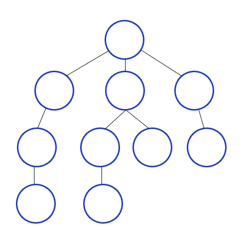

# Tree Data Structure
=======================

## Definition
A collection of trees is called a **forest**. A tree is a hierarchical data structure consisting of nodes, where each node has a value and zero or more child nodes.

### Components
* **Edges**: Called **branches**, these connect nodes in the tree.
* **Child**: Called a **leaf**, a node with no children.
* **Tree**: An extension of the linked list
	+ First element: **Root**, the topmost node.
	+ Each element contains:
		- **Data**, the value stored in the node.
		- **Multiple next elements (children)**, nodes connected to the current node.
	+ Each element: Called a **node**, a single point in the tree.

## Properties
* Must be **completely connected**, every node is reachable from the root.

## Terminology
* **Parent (P)**: A node that has children.
* **Child (C)**: A node that has a parent.
* **Siblings**: Children at the same level, sharing the same parent.
* **Ancestors**: Nodes above a given node, including its parent, grandparent, etc.
* **Descendants**: Nodes below a given node, including its children, grandchildren, etc.
* **Leaf/External Node**: A node with no children.
* **Internal Node**: A node with children (i.e., a parent node).
* **Height**:
	+ Leaf: 0, the height of a leaf node.
	+ Parent: 1 (and incremented for each level), the height of a parent node.
* **Depth**: Number of edges to the root, the distance from the root to a node.
* **Level**: A horizontal layer of nodes, all nodes at the same depth.

## Tree Traversal
Methods to visit each node in the tree:

* **DFS (Depth First Search)**
	+ **Pre-Order**: Check off the node as you see it before traversing further.
	+ **In-Order**: Check off all left children, then move to parents.
	+ **Post-Order**: Check off a node after visiting all its descendants.
* **Time Complexity**
	+ Search: O(n), time taken to find a node.
	+ Delete: O(n), time taken to delete a node.
	+ Insert: O(n), time taken to insert a node.

## Binary Search Trees (BSTs)
A special type of tree where:

* **Properties**
	+ Every node on the left is smaller than the parent.
	+ Every node on the right is larger than the parent.
* **Time Complexity**
	+ Search: log(n), time taken to find a node.
	+ Insert: log(n), time taken to insert a node.

## Unbalanced Binary Trees
A tree where the height of the left and right subtrees differs significantly:

* **Time Complexity**
	+ Search, Insert: Worst case O(n), time taken to find or insert a node.

## Usage
* **Database**: Trees are used to index data for efficient querying.
* **Machine Learning**: Decision Trees are used for classification and regression tasks.